#  Hybrid Infrastructure Monitoring using AWS CloudWatch

Implemented hybrid monitoring by integrating an on-prem VM with AWS CloudWatch using CloudWatch Agent. Created dashboards and alarms, enabling centralized visibility and real-time alerts via SNS for both cloud and on-prem infrastructure.

---

##  Project Overview

This project demonstrates a **Hybrid Monitoring Architecture** where an on-premise server (VM) is integrated with AWS CloudWatch for centralized monitoring and alerting.

The system collects metrics from:

*  AWS EC2 instance
*  On-Premise VM

and displays them in a **single CloudWatch dashboard** with alerting via SNS.

---

##  Architecture

On-Prem VM → CloudWatch Agent → AWS CloudWatch
↓
EC2 Instance → CloudWatch Metrics → Dashboard + Alarm → SNS Email Alert

---

##  Technologies Used

* AWS CloudWatch
* AWS EC2
* AWS SNS
* IAM
* Ubuntu (VM)
* CloudWatch Agent

---

##  Project Setup Steps

###  1. On-Prem VM Setup

* Created Ubuntu VM using VirtualBox
* Installed CloudWatch Agent

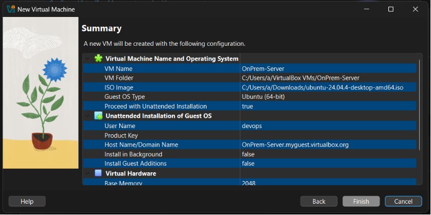
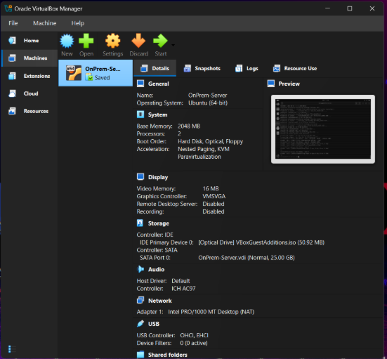

---

###  2. EC2 Instance Setup

* Launched EC2 instance (Ubuntu)
* Attached IAM Role with CloudWatch permissions

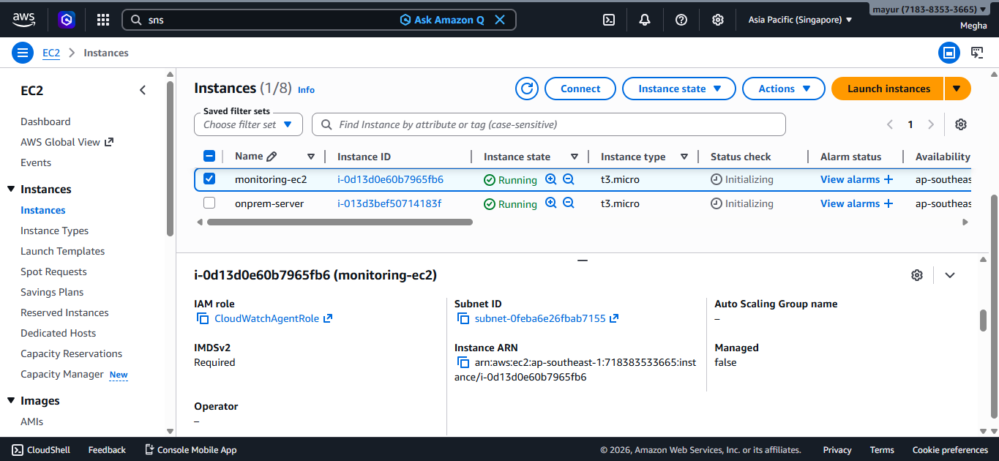

---

###  3. CloudWatch Agent Configuration

* Configured agent on both EC2 and VM
* Collected metrics:
  * CPU
  * Memory
  * Disk

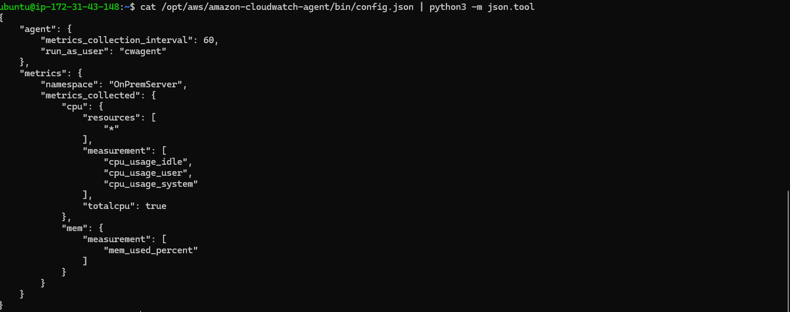

---

###  4. Agent Running Verification

* Started CloudWatch agent
* Verified service status

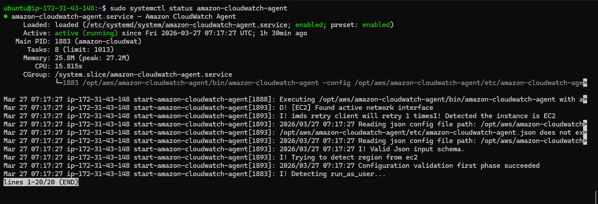

---

###  5. Metrics Verification

* Verified metrics in CloudWatch
* EC2 metrics → CPUUtilization
* VM metrics → mem_used_percent

---

###  6. Dashboard Creation

* Created CloudWatch Dashboard:
  * EC2 CPU
  * VM Memory
  * VM Disk

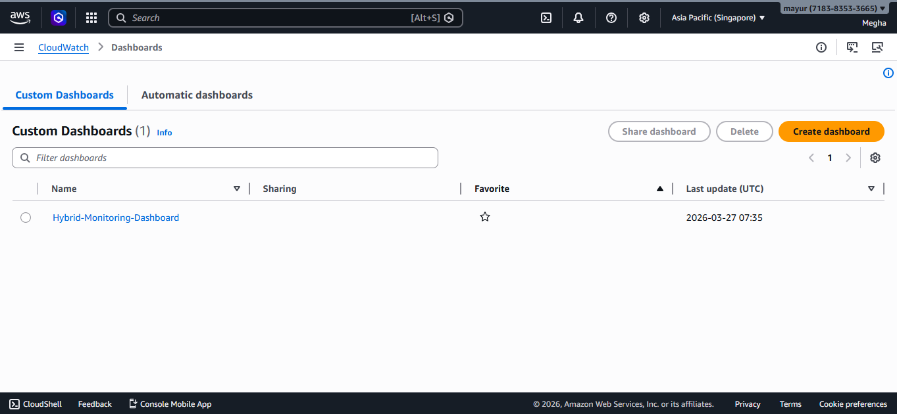

---

###  7. SNS Notification Setup

* Created SNS Topic
* Subscribed email for alerts

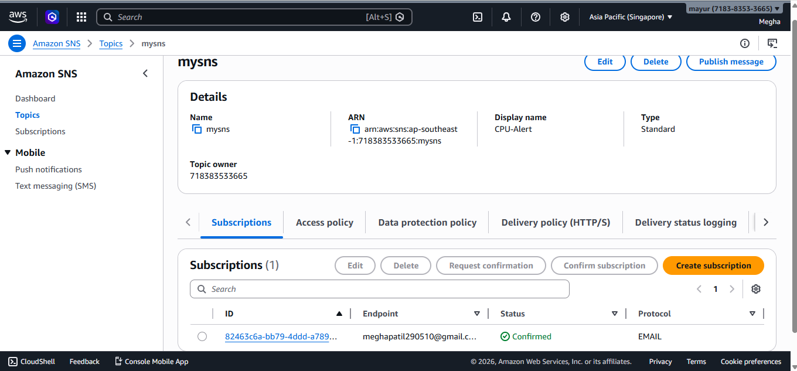
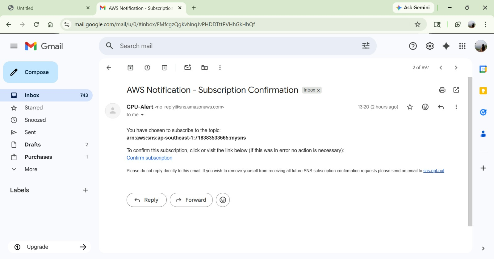

---

###  8. Alarm Configuration

* Created alarm:
  * EC2 CPU > 70%
  * VM Memory > 70%

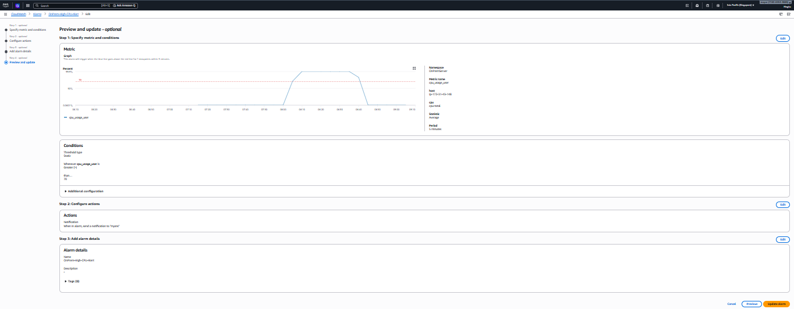

---

###  9. Testing (Stress Load)

* Generated load using stress command
* Verified:
  * Metric spike
  * Alarm triggered
  * Email received

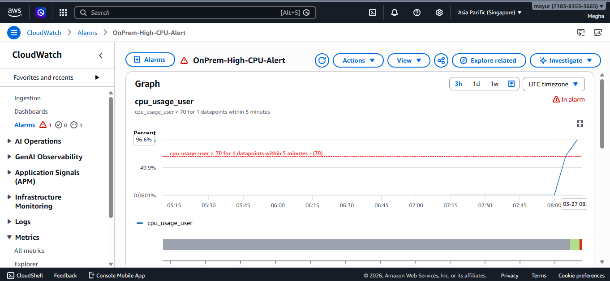
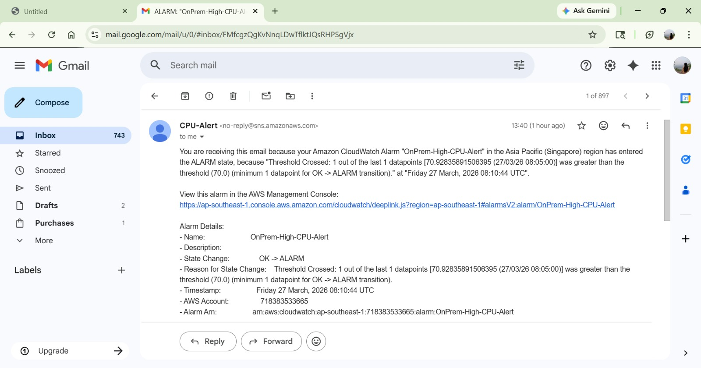

---

##  Final Outcome

* Centralized monitoring of hybrid infrastructure
* Real-time metric visualization
* Automated alerting system
* Successfully validated monitoring using stress testing

---

##  Key Learnings

* Hybrid cloud monitoring architecture
* CloudWatch Agent configuration
* Custom metrics collection
* Dashboard and alert setup
* Troubleshooting real-world issues

---

##  Conclusion

This project successfully demonstrates how to integrate on-premise infrastructure with AWS monitoring services to achieve centralized visibility and proactive alerting.

---

##  Author

**Megha Patil**
